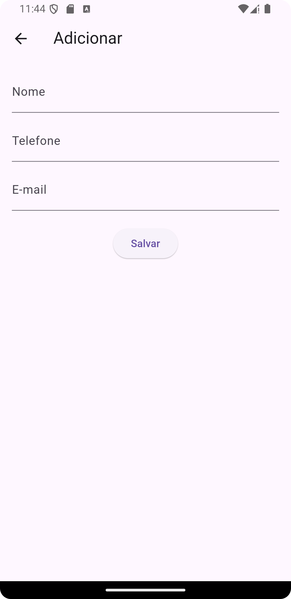

# Projeto Integrador - Gerenciamento de Contatos

## Objetivo
Este projeto tem como objetivo o desenvolvimento de um aplicativo móvel que permita realizar operações de **CRUD** (Create, Read, Update, Delete) em um banco de dados local. O aplicativo gerencia uma lista de contatos pessoais, permitindo que o usuário adicione, consulte, altere e exclua informações.

## Funcionalidades

- **Cadastro de Contato:** Permite adicionar novos contatos com nome, telefone e e-mail.
- **Listagem de Contatos:** Exibe todos os contatos cadastrados, permitindo visualizar, editar ou excluir.
- **Edição de Contato:** Permite editar os dados de um contato existente.
- **Exclusão de Contato:** Permite excluir um contato após confirmação.

## Tecnologias Usadas

- **Flutter** (para desenvolvimento mobile)
- **SQLite** (banco de dados local)

## Como Rodar o Projeto

1. Clone o repositório:
   `git clone git@github.com:fabyanroger/projeto-flutter.git`

2. Entre no diretório do projeto:
   `cd projeto-flutter`

3. Instale as dependências:
   `flutter pub get`

4. Execute o aplicativo:
   `flutter run`

**Nota:** Certifique-se de ter o [Flutter](https://flutter.dev/docs/get-started/install) e o [Android Studio](https://developer.android.com/studio) instalados.

## Capturas de Tela

Aqui estão algumas capturas de tela do aplicativo:

### Tela de Listagem e Tela de Cadastro

  
  

### Tela de Edição e Tela de Exclusão

  
  

## Integrantes do Projeto

<table>
  <tr>
    <td align="center">
      <a href="https://github.com/fabyanroger">
         
        
          <b>Fabyan Roger</b>
        
      </a>
    </td>
    <td align="center">
      <a href="#">
         
        
          <b>Nome do Segundo Integrante</b>
        
      </a>
    </td>
    <td align="center">
      <a href="#">
         
        
          <b>Nome do Terceiro Integrante</b>
        
      </a>
    </td>
  </tr>
</table>
